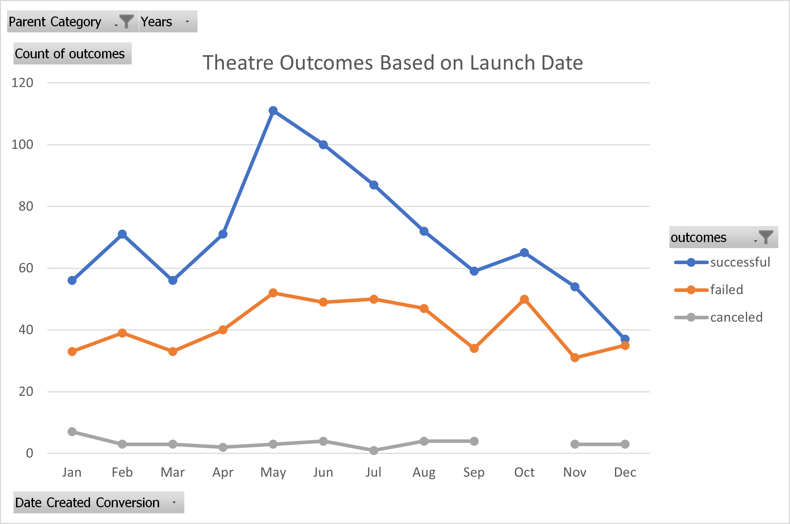
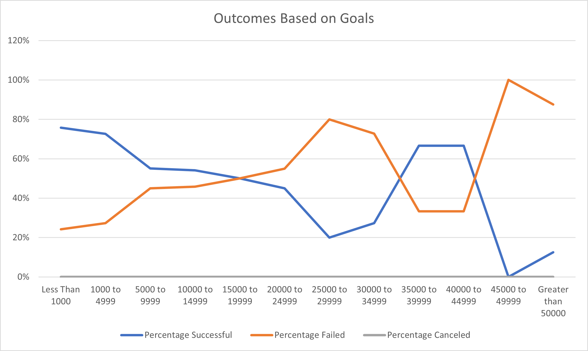

# Kickstarter Analysis with Excel

## Kickstarter Outcomes based on Launch Date and Kickstarter Goals

### Purpose
When launching a new Kickstarter campaign, two questions may come up: how much should the Kickstarter Goal be set at, and when would be the best time to launch said campaign? 

In this analysis, theater (specifically plays) Kickstarters were analyzed to see which months had the most successes/failures/cancelled outcomes, as well as which goals ranges had the highest percentages in these outcomes.

## Analysis and Challenges

### Outcomes Based on Launch Date

To assess the monthly trends from the Kickstarter data, a pivot table was created to compare the count of each campaign outcome (Successful, Failed, Cancelled), filtering to **Theatre** as the only the  `Parent Category` and `Years`:


To visualize these campaign outcomes based on their launch date, a line chart was used to highlight the frequency of each outcome occuring, which was then compared to the month the campaign was launched:
</img>


### Outcomes Based on Goals for Plays

</img>

To get the frequency of occurances the `COUNTIFS()` formula was used to find the corresponding count, to the set goal ranges. 

```
=COUNTIFS(Kickstarter!D:D,"<1000",Kickstarter!F:F,"successful",Kickstarter!R:R,"plays")
```

This formula 

### Challenges and Difficulties Encountered

The raw data from Kickstarter had a UNIX timestamps as their value for dates, which refers to the number of seconds that have been spent since January 1, 1970. To have them converted to a more readable YYYY-MM-DD format, a [unix converter](https://www.epochconverter.com/) could be used. But a better alternative is to convert the UNIX timestamp with the following formula in Excel:

```
=(((J2/60)/60)/24)+DATE(1970,1,1)
```

Where `J2` is the cell reference of the UNIX timestamp to be converted, which is then divided by 60 (seconds), then divided by 60 (minutes), an lastly diveded by 24 (hours). And since the start of the UNIX timestamp started on January 1st, 1970, we add this date to the calculated days,minutes,seconds calculated in the first part of the formula.

Another challenge was encountered during the creation of the pivot table to group the theater outcomes count vs. launch date. There were difficulties in displaying the date by month, as the date field parses additional date fields - 'Quarters' and 'Years' - but no field for 'Month' could be found. To be able to display the pivot table by Month, the Years and Quarters field had to be removed from the rows area of the pivot table and the months were shown.

## Results

- What are two conclusions you can draw about the Outcomes based on Launch Date?

The number of successful outcomes for plays that have Most successful in May

no cancelations in October

Avoid launching around wintertime - most likely people are more likely using their disposable income on christmas presents instead of funding project they won't see the 

- What can you conclude about the Outcomes based on Goals?


### Limitations of this dataset
- What are some limitations of this dataset?

Compare with other crowdfunding platforms like [Indiegogo](https://www.indiegogo.com/), and see if the data supports the same successes as crowdfunding with Kickstarter

Duration of the kickstarter could impact the success/failure of the campaign. Some projects have a 

- What are some other possible tables and/or graphs that we could create?

Regression analysis on fund and success of Kickstarter

Check for trends by year and not just by month. Yearly trends can change. Need to make sure that her style of play is popular in recent years

Regional successes. Which plays are most successful in which region. If she's in GB, but the play she wants to make is more successful in the US, she should have it done in the highest success region