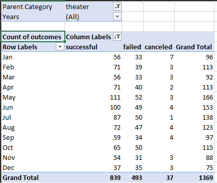
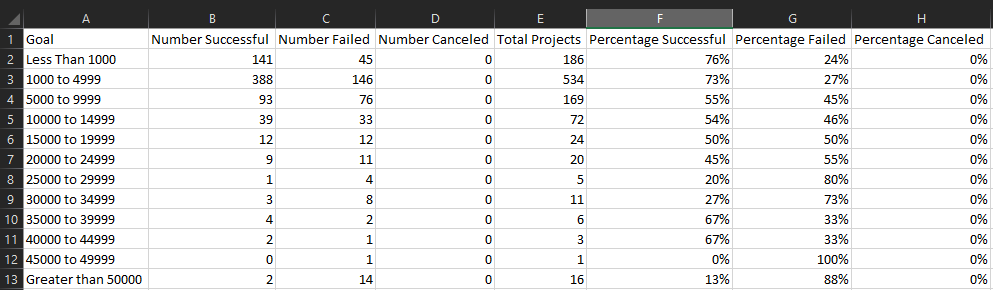

# Kickstarter Analysis with Excel

## Kickstarter Outcomes based on Launch Date and Kickstarter Goals

### Purpose
When launching a new Kickstarter campaign, two questions may come up: how much should the Kickstarter Goal be set at, and when would be the best time to launch said campaign? 

In this analysis, theater (specifically plays) Kickstarters were analyzed to see which months had the most successes/failures/cancelled outcomes, as well as which goals ranges had the highest percentages in these outcomes.

## Analysis and Challenges

### Outcomes Based on Launch Date

To assess the monthly trends from the Kickstarter data, a pivot table was created to compare the count of each campaign outcome (Successful, Failed, Cancelled), filtering to **Theater** as the only the  `Parent Category` and `Years` - to see the full excel file please see [Kickstarter_Challenge.zip](Kickstarter_Challenge.zip):

*Table 1 - Outcomes vs Launch Date*

</img>

To visualize these campaign outcomes based on their launch date, a line chart was used to highlight the frequency of each outcome occuring, which was then compared to the month the campaign was launched:
</img>


### Outcomes Based on Goals for Plays

In order to visualize the percentage of **successful**, **failed**, and **cancelled** plays, we first needed to get the frequency of occurances useing the `COUNTIFS()` function in excel. And to be able to group projects based on their goal amounts, we used the following goal ranges:

* Less Than 1000
* 1000 to 4999
* 5000 to 9999
* 10000 to 14999
* 15000 to 19999
* 20000 to 24999
* 25000 to 29999
* 30000 to 34999
* 35000 to 39999
* 40000 to 44999
* 45000 to 49999
* Greater than 50000

These ranges were incorporated into the `COUNTIFS()` function, by making sure to only count the occurances with the criteria in the corresponding `Goal` range, its `outcome` (being either *successful/failed/cancelled*), and `subcategory` (being *plays*)

*Example of `COUNTIFS()` function for successful plays that had a goal range of Less than 1000 - Cell B2:*
```
=COUNTIFS(Kickstarter!D:D,"<1000",Kickstarter!F:F,"successful",Kickstarter!R:R,"plays")
```

The resulting table:

### *Table 2 - Outcomes vs Goals*

</img>

A line graph was used to visualize the percentages found: 

</img>


### Challenges and Difficulties Encountered

The raw data from Kickstarter had a UNIX timestamps as their value for dates, which refers to the number of seconds that have been spent since January 1, 1970. To have them converted to a more readable YYYY-MM-DD format, a [unix converter](https://www.epochconverter.com/) could be used. But a better alternative is to convert the UNIX timestamp with the following formula in Excel:

```
=(((J2/60)/60)/24)+DATE(1970,1,1)
```

Where `J2` is the cell reference of the UNIX timestamp to be converted, which is then divided by 60 (seconds), then divided by 60 (minutes), an lastly diveded by 24 (hours). And since the start of the UNIX timestamp started on January 1st, 1970, we add this date to the calculated days,minutes,seconds calculated in the first part of the formula.

Another challenge was encountered during the creation of the pivot table to group the theater outcomes count vs. launch date. There were difficulties in displaying the date by month, as the date field parses additional date fields - 'Quarters' and 'Years' - but no field for 'Month' could be found. To be able to display the pivot table by Month, the Years and Quarters field had to be removed from the rows area of the pivot table and the months were shown.

## Results and Conclusions

Based on the resulting analysis, the highest amount of successes for launching theater Kickstarters could be found in the Month of May. This may be due to the increased total kickstarters during this month, but as a percentage of total kickstarters it has the highest rate of 67% [(111 successes of 166 total kickstarters in May)](#outcomes-based-on-launch-date).

On the other hand, December has the lowest frequency and the lowest rate of successes out of all the months of the year. An assumption could be that leading up to the Christmas months, Kickstarters may not be as successful as people are more likely using their disposable income on christmas presents instead of funding project they won't see the result of until much into the future, in the chance the projected reaches its target and begins production.

As for setting a Kickstarter Goal, it can be concluded that as a goal is increased, the chances of success decreases, and failure increases. There is an increase in success rate in the 35,000 to 39,999, and 40,000 to 44,999 range, but the total projects that were successful at these ranges were [4 and 2 (out of 6 and 3 total projects)](#outcomes-based-on-goals-for-plays) respectively which is not enough data. 


### Limitations of this dataset

Some limitations of this Kickstarter dataset is that it is somewhat outdated. The latest datapoint is for January 2017, and to make relevant decisions for today's environment, we should include the most up-to-date datapoints.

While there is a limited sample size (4113 datapoint), there is also a lack of other useful data we could use to provide a more robust analysis. Such data as knowing the subgenre of play (ie. comedy, tragedy, historical, etc.). Knowing the duration of the kickstarter funding campaign, could tell us what is the best amount of time to leave the campaign open for funding. Lastly, if a project has pledge rewards and what tiers are backers pledging to the project most.


We could also compare with Kickstarter with other crowdfunding platforms like [Indiegogo](https://www.indiegogo.com/), and see if the data supports the same successes as crowdfunding with Kickstarter


### Recommendations

While we looked at the trends of the frequency of successes and failures month per month, other possible tables and/or graphs could be created in seeing if there are trends by year. Theatre could have been very popular at a certain period of time, but as of recent years its popularity could have decreased, making plays a much harder campaign to fund.

An additional recommended data analysis that could be looked at would be seeing the successes and failures by region. Depending on which region the play will be launched, the success rate should highlight which region plays are most successful. For example, 

Regional successes. Which plays are most successful in which region. If she's in GB, but the play she wants to make is more successful in the US, she should have it done in the highest success region